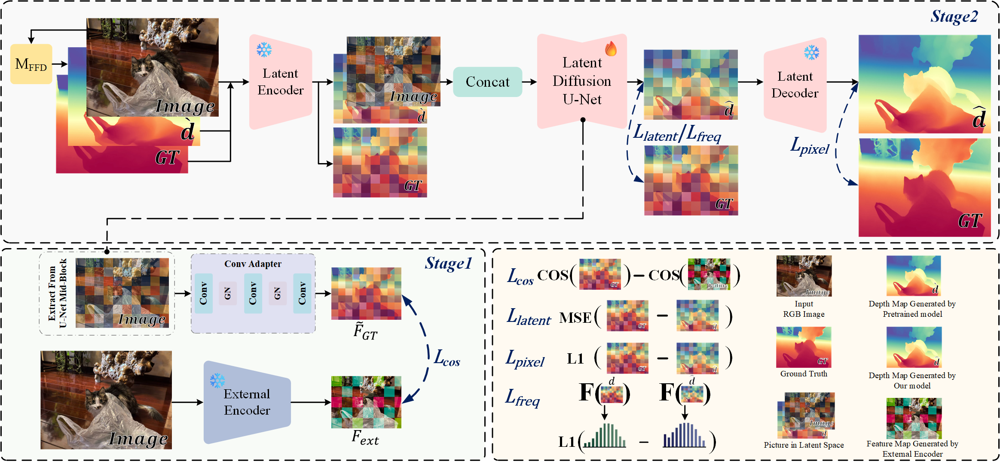
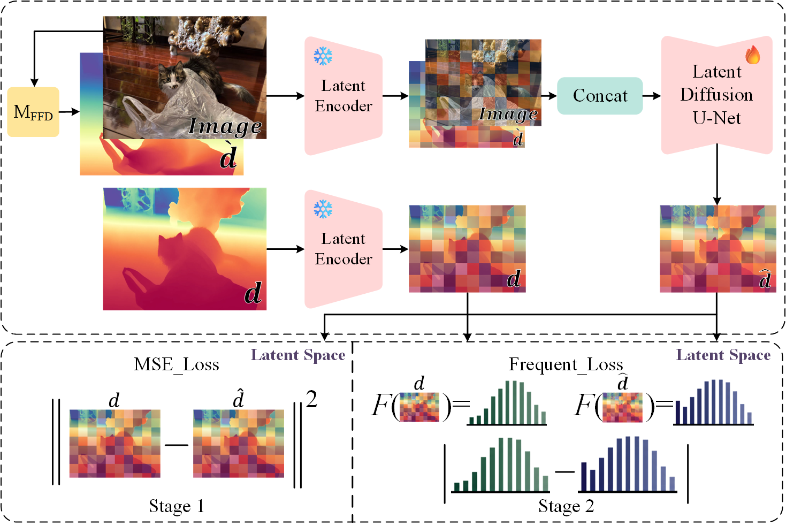
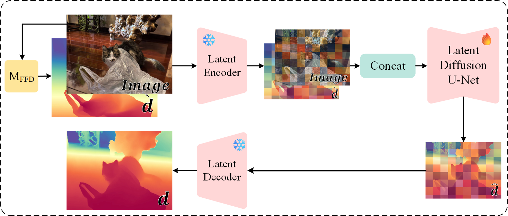
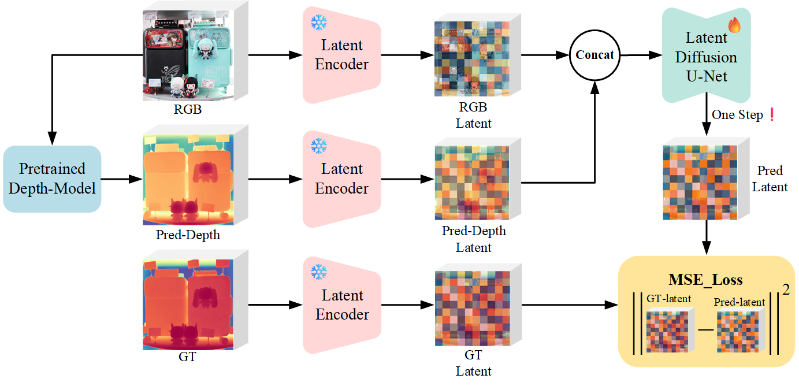
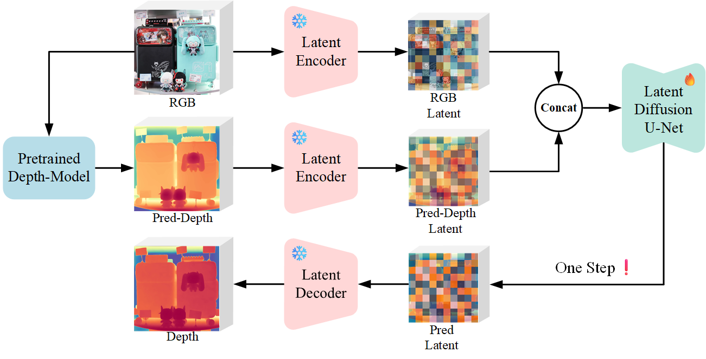

# Changelog

This file records the notable changes in ApDepth from the complete Git history. Release dates follow the commit dates referenced by the repository's lightweight tags.

## Unreleased — ApDepth V2.1

### Added

- Added direct Stage 2 fine-tuning from the original Stable Diffusion 2.1 checkpoint, without requiring Stage 1 training.
- Added Spatially Debiased Window Transport (SDWT) for geometry-aware local depth supervision, with gradient loss and an optional low-weight frequency loss.
- Added separate configurations for SDWT training, SDWT with FFT, and component-level loss ablations.
- Added optional VAE decoder fine-tuning and checkpoint save/load support.
- Added SafeTensors checkpoint export, recursive folder inference, and resumable dataset inference.
- Added VKITTI far-depth post-training and a gradual frequency-loss transition.

### Changed

- Kept the original two-stage and Stage 1 workflows available while documenting three supported training strategies.
- Simplified the repository layout, refreshed model configuration and checkpoint links, and updated CI and Docker packaging.

## [ApDepth-V2-0] — 2026-04-06

- Renamed the training and inference package from `marigold` to `apdepth`.
- Reorganized trainer, model configuration, checkpoint directories, and command-line documentation around the ApDepth workflow.
- Updated model download scripts and expanded Docker, training, and inference instructions.

### Architecture

  

## [ApDepth-V1-2] — 2026-04-02

- Extended the two-stage objective from latent frequency refinement to combined latent, pixel, gradient, and surface-normal supervision.
- Added Sobel-based edge masks and revised the evaluation and loss strategies.
- Added DIODE training data support and updated dataset sampling.
- Switched the teacher backbone to Depth Anything V2 Giant and refreshed the training configuration.

### Architecture

  

  

## [ApDepth-V1-1] — 2025-11-01

- Introduced teacher-guided Stable Diffusion 2.1 fine-tuning with Depth Anything V2 depth priors.
- Updated the training pipeline, datasets, evaluation path, and V1.1 configurations for the teacher-guided workflow.

### Architecture

  

  

## [ApDepthv1] — 2025-10-09

- Added the first frequency-domain loss experiments and an eight-channel UNet input path.
- Added training utilities, example assets, and the initial training and inference workflow documentation.

## [ApDepth] — 2025-09-23

- Released the first ApDepth implementation.
- Converted the Marigold-style stochastic multi-step process into deterministic single-step depth prediction based on Stable Diffusion 2.1.
- Added the initial training, inference, evaluation, and dataset pipeline.

## [Backup] — 2025-09-13

- Archived the early repository bootstrap and imported baseline implementation before the first ApDepth release.

[ApDepth-V2-0]: https://github.com/Haruko386/ApDepth/releases/tag/ApDepth-V2-0
[ApDepth-V1-2]: https://github.com/Haruko386/ApDepth/releases/tag/ApDepth-V1-2
[ApDepth-V1-1]: https://github.com/Haruko386/ApDepth/releases/tag/ApDepth-V1-1
[ApDepthv1]: https://github.com/Haruko386/ApDepth/releases/tag/ApDepthv1
[ApDepth]: https://github.com/Haruko386/ApDepth/releases/tag/ApDepth
[Backup]: https://github.com/Haruko386/ApDepth/releases/tag/Backup
